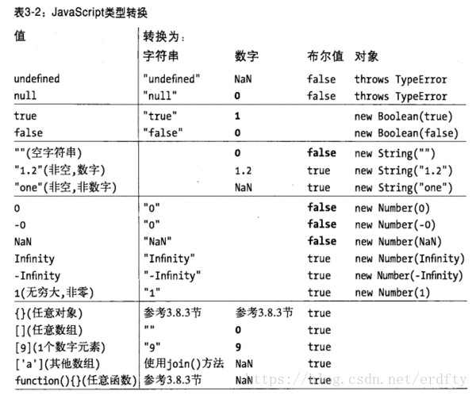

# 20210224
=================
## JS基础
* Javascript规定了几种数据类型？
  + 基本类型：String、Number、Boolean、Null、Undefined、Symbol
    存储：栈内存中存储了变量的标识符和变量的值
  + 引用类型：Object（Object/Array/Function/RegExp/Date）
    存储：引用类型的值存储的是对象的地址(对象的形式存储在堆内存中)
  + 如何检测变量的类型？
    typeof
    ```
    var a
    typeof a // 'undefined'
    a = null
    typeof a // 'null'
    a = 666
    typeof a // 'number'
    a = "hello"
    typeof a // 'string'
    a = Symbol()
    typeof a // 'symbol'
    a = function(){}
    typeof a // 'function'
    a = [] / a = {} / a = /aaa/g
    typeof a // object
    ```
    手写instanceof
    ```javascript
          function instance_of(obj, pro) {
            // 首先验证a为引用类型(function,object,array)
            console.log(Object.prototype.toString.call(obj).slice(8, -1))
            var obj_type = Object.prototype.toString.call(obj).slice(8, -1)
          	if ( obj_type === 'Object' || obj_type === 'Array' || obj_type === 'Function') {
            	var obj = obj.__proto__
            	while(obj) {
            		if (obj === pro.prototype)
	                       return true
	                  obj = obj.__proto__
	               }
	              return false
               }
          }
    ```
  + 类型转换
    
  + null和undefined的区别
    undefined就是访问一个为赋值的变量时放回的值
    null是访问一个尚未存在的对象时放回的值。
    即undefined使空的变量，null是空的对象
* JavaScript对象的底层数据结构是什么？
  JavaScript引用类型数据被存储于堆中 (如对象、数组、函数等，它们是通过拷贝和new出来的）。其实，说存储于堆中，也不太准确，因为，引用类型的数据的地址指针是存储于栈中的，当我们想要访问引用类型的值的时候，需要先从栈中获得对象的地址指针，然后，在通过地址指针找到堆中的所需要的数据。
* Symbol类型在实际开发中的应用?手动实现一个简单的Symbol?
  + 应用场景1：使用Symbol来作为对象属性名(key)
    Symbol类型的key是不能通过Object.keys()或者for...in来枚举的，它未被包含在对象自身的属性名集合(property names)之中。所以，利用该特性，我们可以把一些不需要对外操作和访问的属性使用Symbol来定义。
    当使用JSON.stringify()将对象转换成JSON字符串的时候，Symbol属性也会被排除在输出内容之外。
    这样的话，我们就没办法获取以Symbol方式定义的对象属性了么？非也。还是会有一些专门针对Symbol的API，比如：
    ```
    // 使用Object的API
    Object.getOwnPropertySymbols(obj) // [Symbol(name)]

    // 使用新增的反射API
    Reflect.ownKeys(obj) // [Symbol(name), 'age', 'title']
    ```
  + 应用场景2：使用Symbol来替代常量
    const TYPE_AUDIO = Symbol()
    const TYPE_VIDEO = Symbol()
    const TYPE_IMAGE = Symbol()
  + 应用场景3：使用Symbol定义类的私有属性/方法
  + 注册和获取全局Symbol
    我们在一个浏览器窗口中（window），使用Symbol()函数来定义和Symbol实例就足够了。但是，如果你的应用涉及到多个window（最典型的就是页面中使用了iframe），并需要这些window中使用的某些Symbol是同一个，那就不能使用Symbol()函数了，因为用它在不同window中创建的Symbol实例总是唯一的，而我们需要的是在所有这些window环境下保持一个共享的Symbol。这种情况下，我们就需要使用另一个API来创建或获取Symbol，那就是Symbol.for()，它可以注册或获取一个window间全局的Symbol实例：
    ```
    let gs1 = Symbol.for('global_symbol_1')  //注册一个全局Symbol
    let gs2 = Symbol.for('global_symbol_1')  //获取全局Symbol

    gs1 === gs2  // true
    ```
  

     
